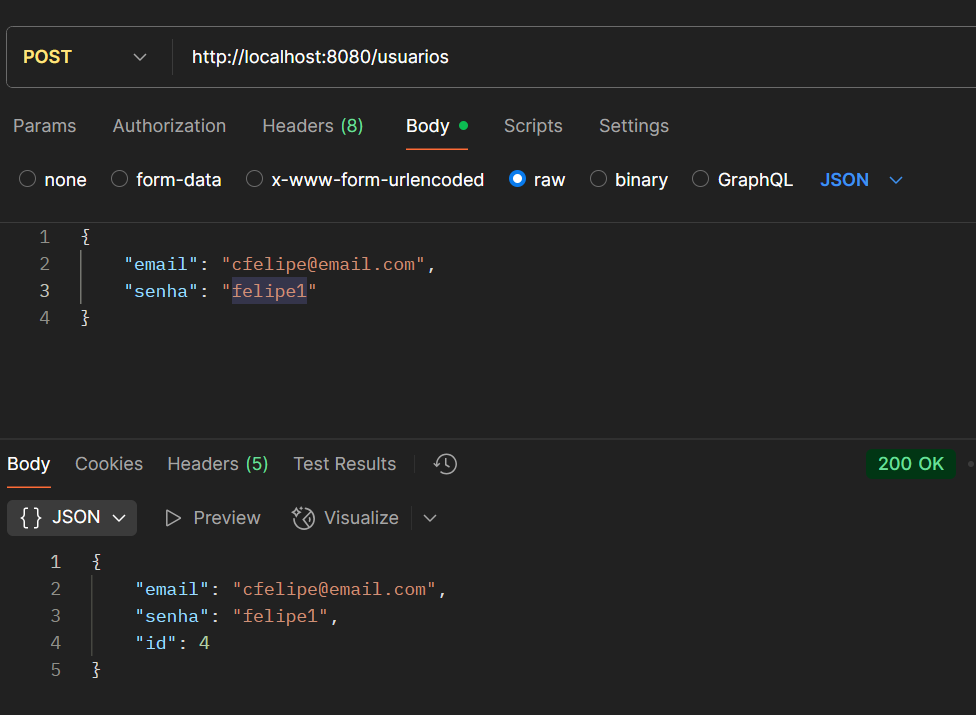
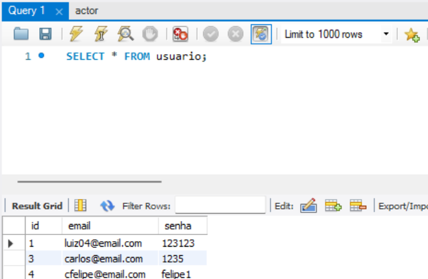

# CRUD-JAVA

## Descrição 📔

Este é um projeto de CRUD (Create, Read, Update, Delete) de usuários, desenvolvido com Java, Spring Boot e MySQL. A aplicação expõe uma API RESTful que permite gerenciar usuários através de requisições HTTP, testadas com o Postman.

## Funcionalidades 🔧

- **Adicionar, Editar e Excluir usuários**
- **Conexão com banco de dados MySQL**
- **API RESTful com troca de dados em JSON**
- **Teste de requisições via Postman**

## Tecnologias usadas ☕

- Java 11+
- Spring Boot
- MySQL
- Postman (HTTP)
- Maven
- JDBC

## Capturas de tela 📸

*Testando Endpoints pelo Postman*

*Banco de dados sendo criado pelo MySQL linkando com o CRUD*

## Melhorias e bugs 🔨🧰🪲

- Adicionar uma interface gráfica (utilizando HTML/CSS)
- Adicionar mais caracteristicas para os usuarios como: Nome, idade e etc.

